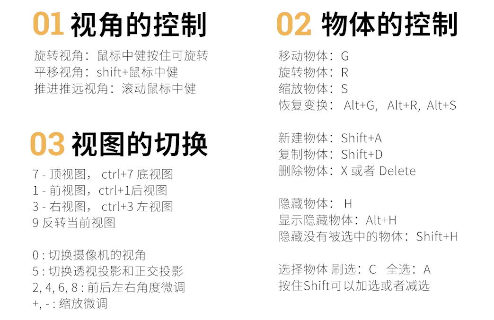
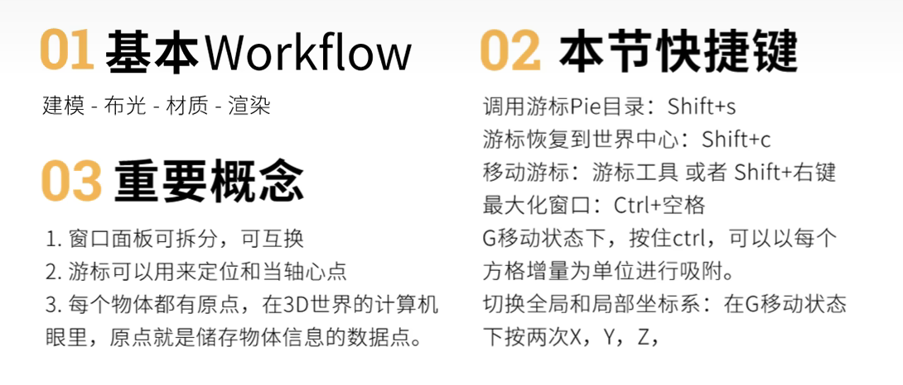

# 快捷键
- [Shift + A] 新建物体
- [G] 移动物体 移动时按住Ctrl可以吸附网格
- [GZ] 沿世界坐标Z轴移动物体 [GZZ] 沿物体局部坐标Z轴移动物体
- [S] 缩放 [SY] 在Y方向上缩放
- [R] 旋转
- [Alt+G] 撤销移动 [Alt+S] 撤销缩放 [Alt+R] 撤销旋转
- [H] 隐藏选中的物体 [Shift+H] 隐藏被选中以外的物体
- [Shift+D] 复制物体
- [~] 弹出Pie目录，可切换视图（主视图、顶视图、左视图等）

# 课件笔记
## 1.2

## 1.3

[Ctrl+Space] 放大当前操作面板
[Shift+S] 弹出Pie目录，选中吸附

# 设置旋转、缩放位置跟随鼠标
