# 导入资源包

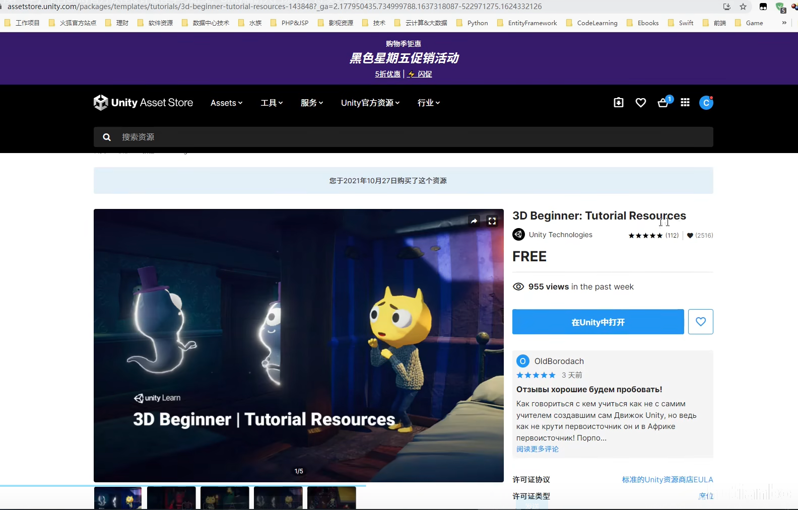

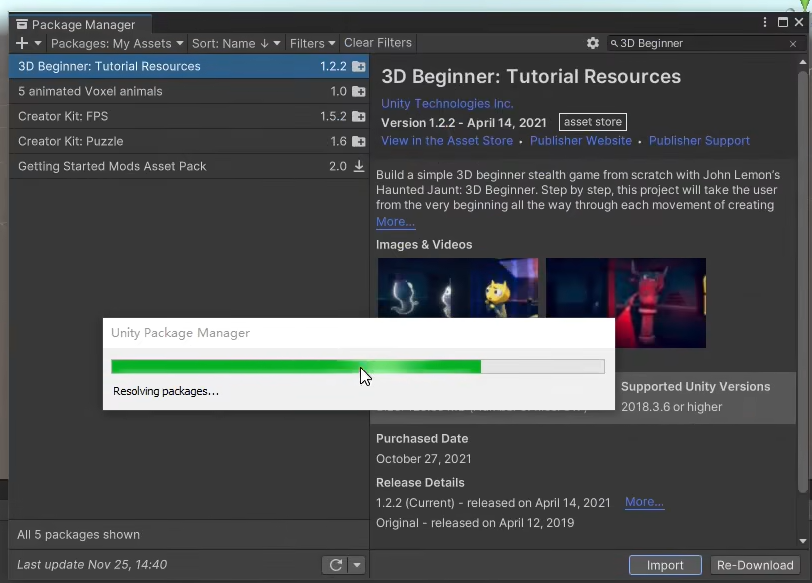

# 创建角色

- 拖到Hierarchy中，直接就在（0,0,0）的位置
  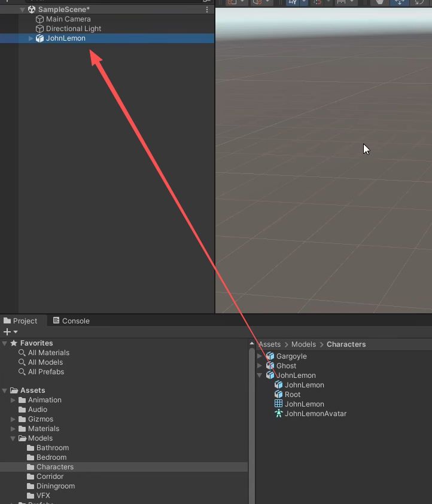
- 进入角色的预制件，添加Animator组件，创建AnimatorController，添加到Animator
- 添加Idle和Walk动画，设置切换条件，取消HasExitTime(了解一下HasExitTime的作用)
  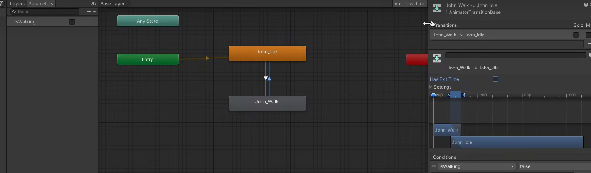
- 在预制件中添加刚体，并设置Animator的UpdateMode为AnimatePhysics（对应FixedUpdate），否则角色直接升天
  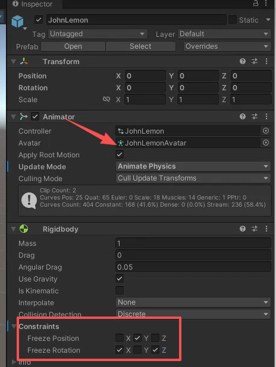
- 添加碰撞体，设置碰撞体大小

# 移动脚本

- 创建脚本，命名为PlayerMovement.cs
- 创建全局变量
  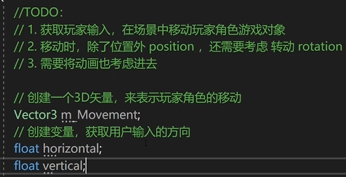
- 刚体组件和动画管理者组件
  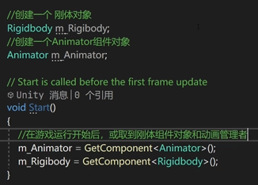
- 获取输入并设置移动
  注意，这里将m_Movement归一化，目的是仅获取它的方向，移动距离由动画来决定，防止移动速度与动画不匹配，造成视觉上的不良体验
  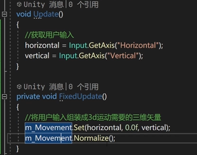
- 移动的动画
  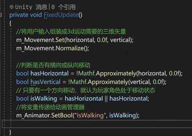
- 实现移动
  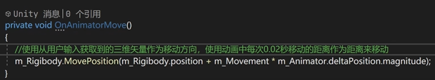
- 转向
  在FixedUpdate()中获取旋转的角度，在动画移动事件中旋转
  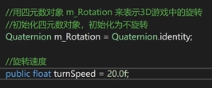
  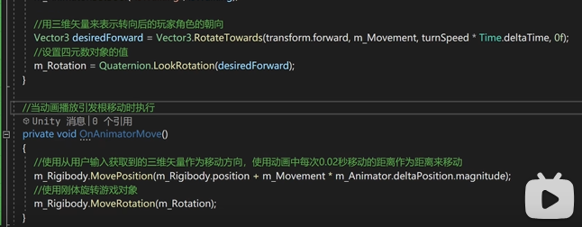

# 场景

- 将场景从预制体拖拽到Hierarchy中
  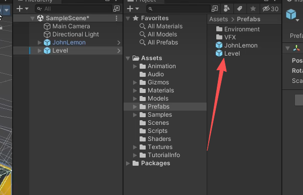
- 点击Gizmos可以吧辅助线隐藏
  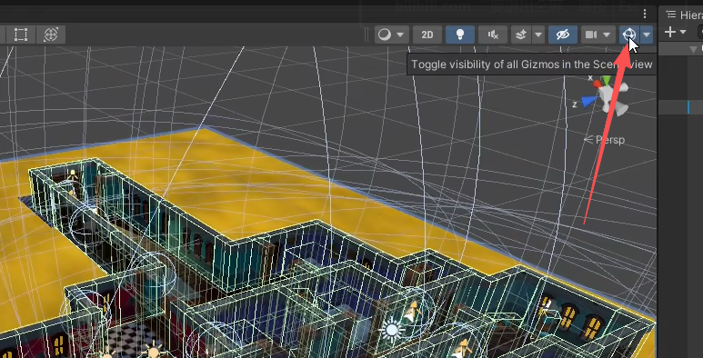
- 设置光源的颜色，使地面的光为淡淡的蓝色月光
  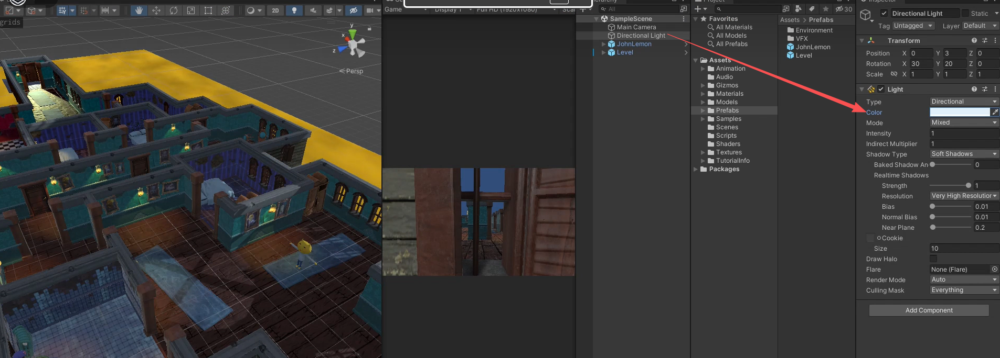
- 设置光照的强度
  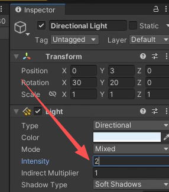
- 设置光照角度，阴影类型、质量
  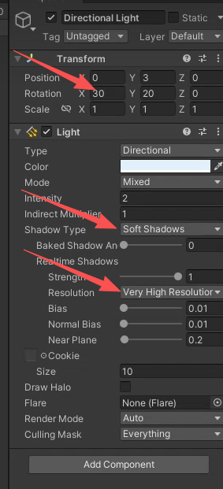
- 设置项目光源
  新建一个环境光，把它放在Assets目录下即可
  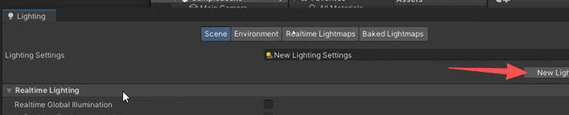
  取消勾选
  
  设置环境光
  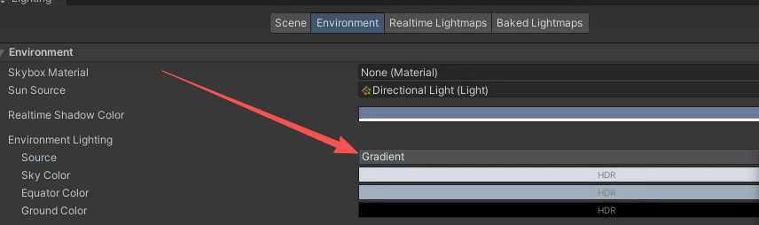
  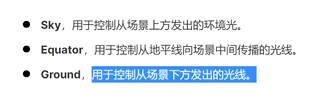
  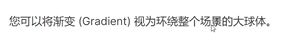
  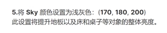
  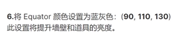
  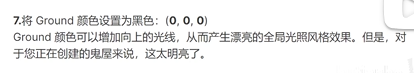
  保存

# 光照

## 实时光照和烘焙光照

- 实时光照: 指 Unity 在运行时计算光照
- 烘焙光照：指 Unity 提前执行光照计算并将结果保存为光照数据，然后在运行时应用。
- 混合光照：实时光照、烘焙光照两者的混合.

## 项目光源设置

  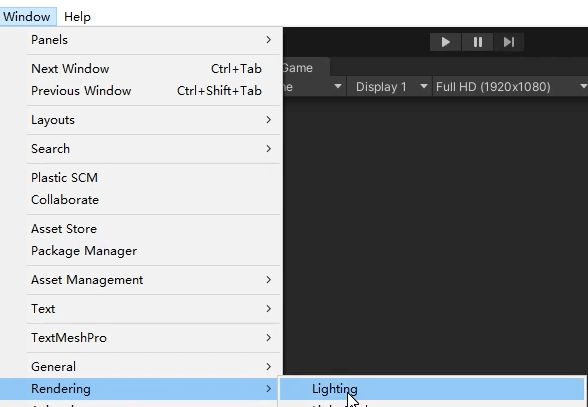

# 导航网格

## 组成

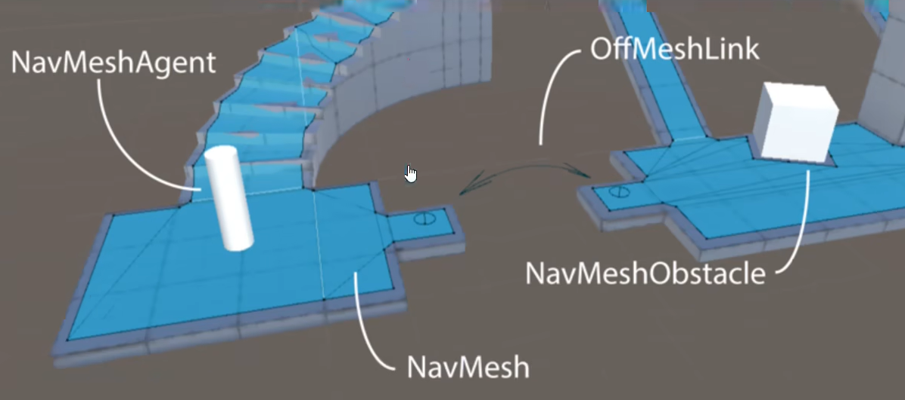

- 导航网格(即 Navigation Mesh，缩写为 NavMesh)
  是一种数据结构，用于描述游戏世界的可行走表面，并允许在游戏世界中寻找从一个可行走位置到另一个可行走位置的路径。该数据结构是从关卡几何体自动构建或烘焙的。
- 导航网格代理(NavMesh Agent) 组件
  可帮助您创建在朝目标移动时能够彼此避开的角色。代理使用导航网格来推断游戏世界，并知道如何避开彼此以及移动的障碍物。
- 网格链接(Off-Mesh Link) 组件
  允许您合并无法使用可行走表面来表示的导航捷径。例如，跳过沟渠或围栏，或在通过门之前打开门，全都可以描述为网格外链接。
- 导航网格障碍物(NavMesh Obstacle)组件
  可用干描述代理在世界中导航时应避开的障碍物。由物理系统控制的木桶或板条箱便是障碍物的典型例子。障碍物正在移动时代理将尽力避开它，但是障碍物一旦变为静止状态，便会在导航网格中雕刻一个孔，从而使代理能够改变自己的路径来绕过它或者如果静止的障碍物阻挡了路径，则代理可寻找其他不同的路线。

## 设置导航网格

- 导航网格应该是static的，所以将Hierarchy中的Level设置的Static，包括其子对象，但天花板不应该设置导航网格，所以将天花板的static取消
  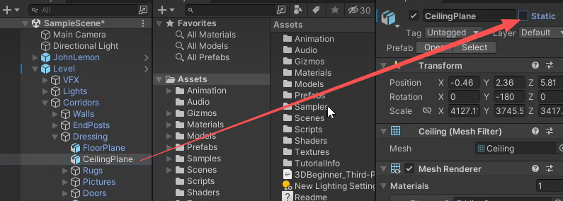
- 打开Navigation
  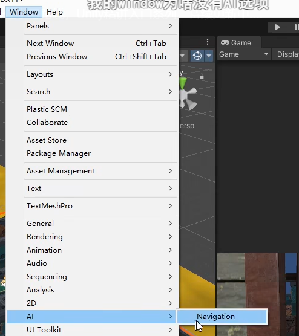
- 修改半径（为什么？），烘焙
  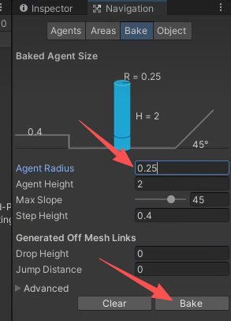

# 镜头跟随

## Cinemachine虚拟摄像机简介
- 在场景中创建一个或多个“虚拟"摄像机
- 使用 Follow 属性指定要跟随的 GameObject;
- 使用 Look At 属性指定虚拟相机应该瞄准的游戏对象。
- 这些虚拟摄像机由一个名为 Cinemachine Brain 的组件进行管理。
- Cinemachine Brain 与 Camera 组件连接到相同的游戏对象，默认情况下，这个游戏对象将是 Main Camera 游戏对象。Cinemachine Brain 管理所有虚拟摄像机，并确定实际摄像机应跟随哪个虚拟摄像机(或虚拟摄像机的组合)

## 使用Cinemachine
- 创建虚拟摄像机，如果没有这个选项的话，就在Window中安装
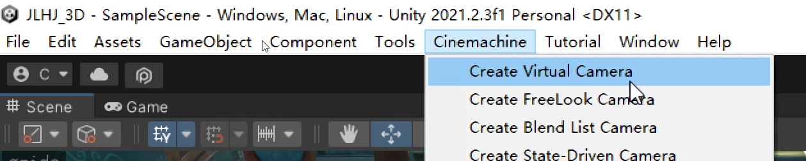

- 此时在MainCamera中会出现Cinemachine Brain组件
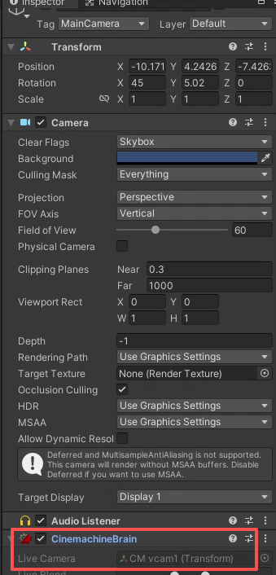

- 添加角色到虚拟摄像机的Follow
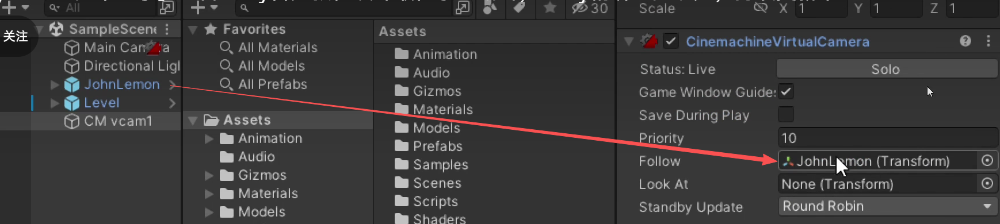

- 设置与玩家的距离
- Aim表示瞄准，可以用来旋转，先选择Do Nothing
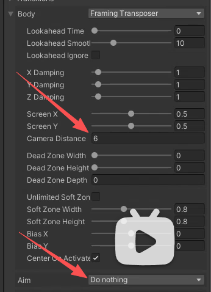

- 设置MainCamera的旋转角度
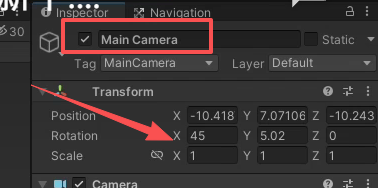

# 后期特效
## 抗锯齿
- 添加Layer
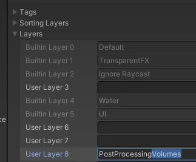

- 在MainCamera中添加组件，没有的话可以在packageManage中下载
  设置层为上一步添加的层，选择快速，这个模式性能较高，效果一般
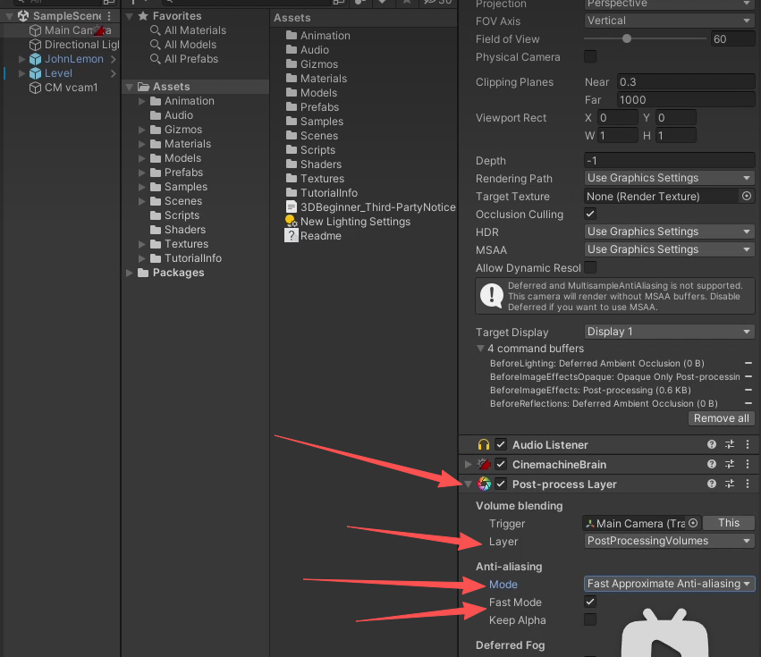

## 颜色分级
- 在Hierarchy中新建一个空对象，将其Layer设置为后期处理层，添加Post-process Volume组件
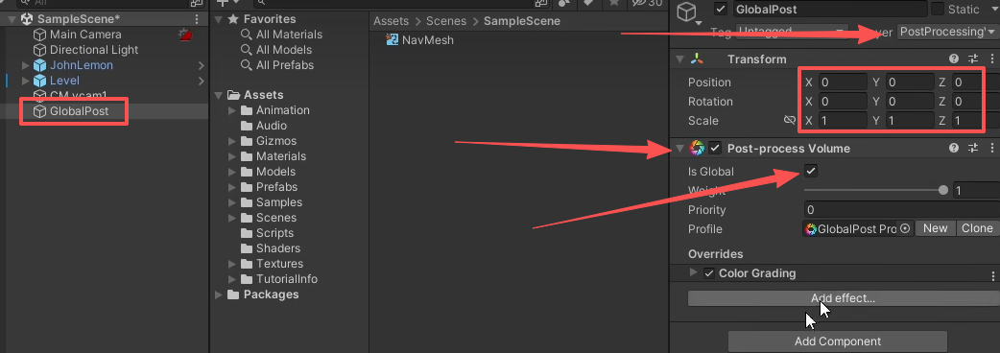

- new 一个 profile,他会保存在Assets中Scene的目录下
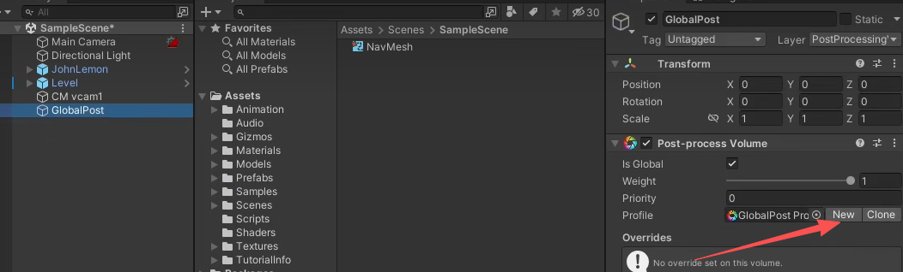
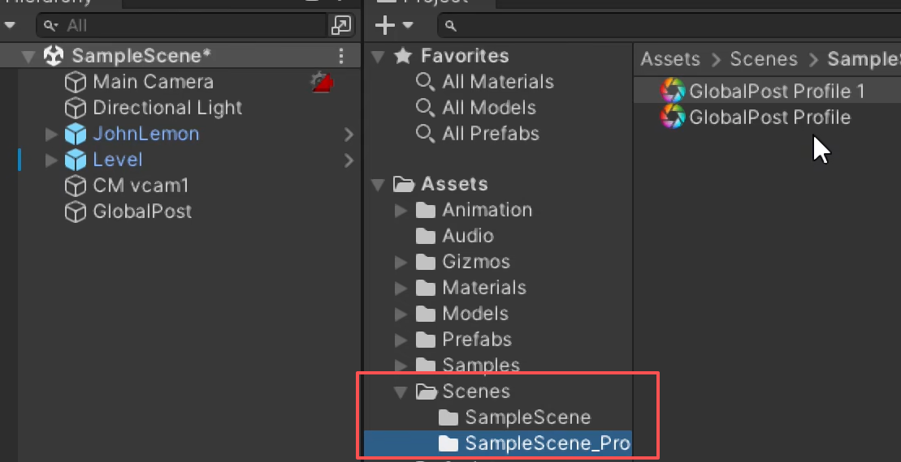

- 添加 **颜色分级** 效果
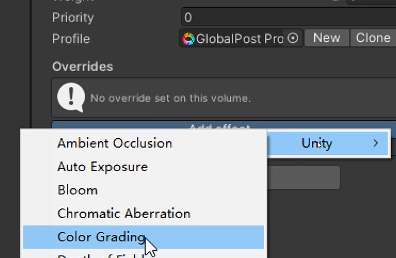

- 打开 **色调映射**，对比一下开和不开的区别，如果不生效，勾选上Is Global，
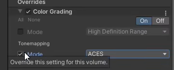

- **曝光** 设为1
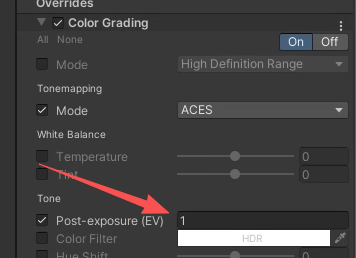

- 色调
  Lift 会影响阴影的颜色
  Gain 会更改更亮的高光
  Gamma 涵盖图像颜色中间（或中间范围）的所有内容
  将Lift 和 Gamma 略微拖向蓝色，Gain略微拖向黄色，增加阴影的深度并增加光照的温暖度
  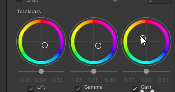

### 泛光效果
- 添加Bloom
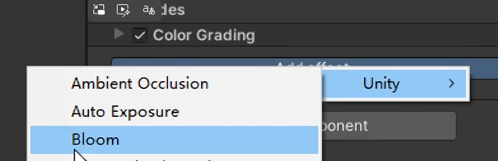

- 点All全部打开
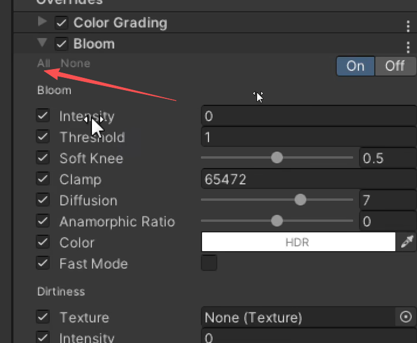

- 强度设为2.5，就能看到泛光效果了
  Intensity 强度
  Threshold 阈值，表示光强大于这个值的光才能使用泛光效果
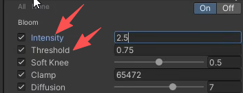
  能够看到这个位置泛光效果比较明显
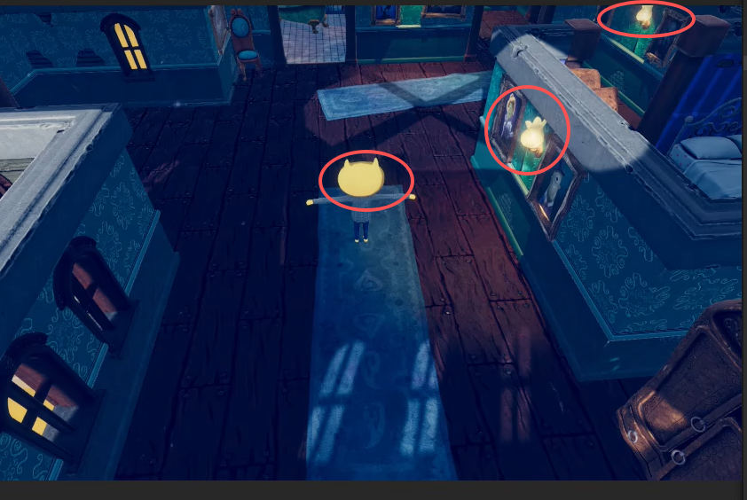

### 环境光遮挡
- 添加效果，打开后阴影会更加明显
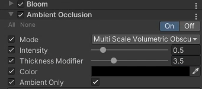

### 渐晕特效
- 使屏幕周围出现阴影
  Intensity 决定阴影效果在屏幕上散步的距离
  Smoothness 决定这种效果朝着屏幕中心淡入淡出的距离
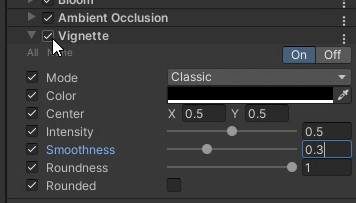
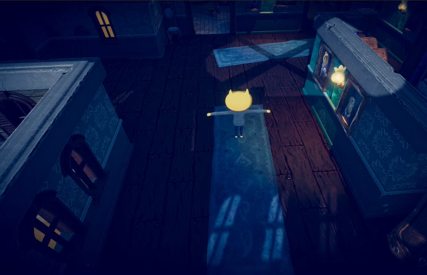

### 镜头失真特效
- 左右滑动Intensity会有一张凸透镜凹透镜的效果
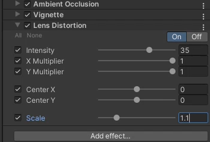