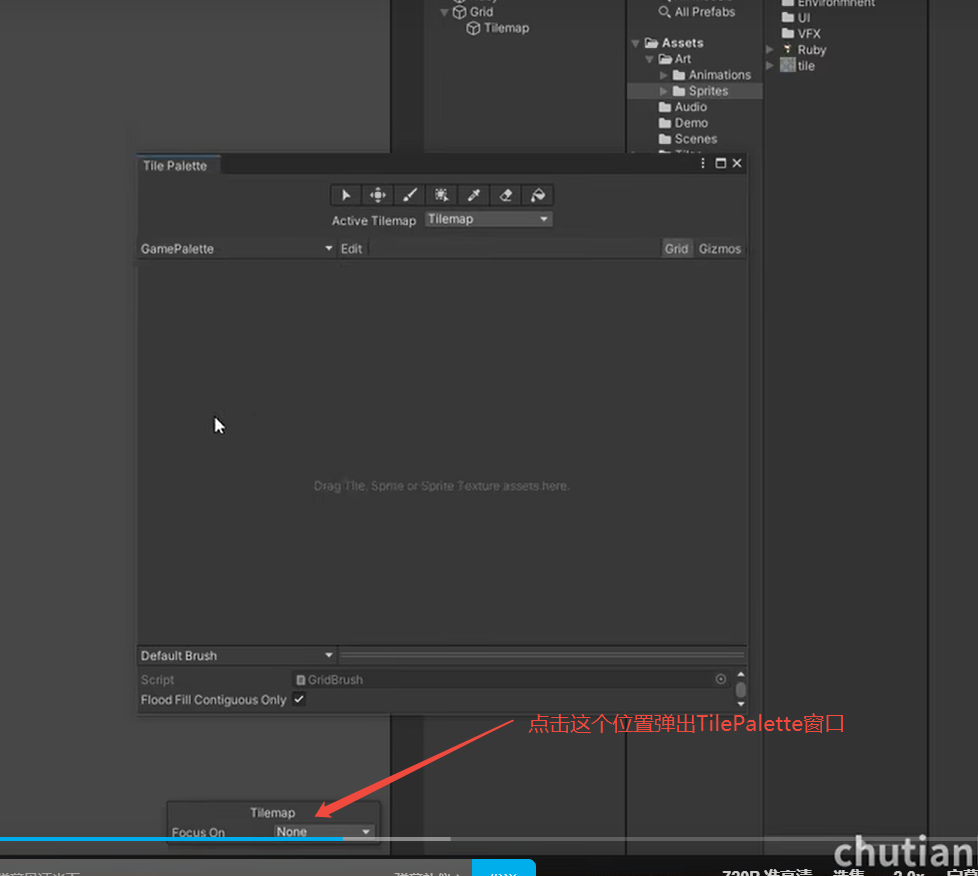
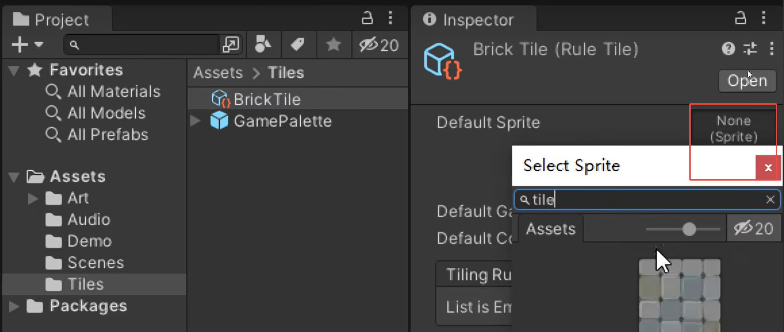
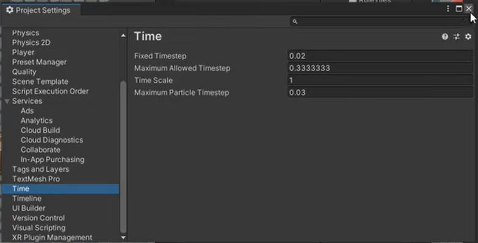

# 组件

<!-- todo: 待验证 -->
发生碰撞的两个物体必须都具备碰撞体组件，其中一个必须有刚体组件

## RigidBody 刚体
- Mass 质量: 影响物体移动的惯性，重力越大，起步越慢，停下时滑动越久，常用值 [1]
- Friction 摩擦力，常用值 [5]
- Angular Friction 旋转摩擦力，常用值 [0.05]
- Gravity 重力，让物体自然下坠，不需要则设为0
- Is Kinematic 是运动学的，true: 该刚体对象将不会被物理引擎驱动，只能通过修改Transform变换位置

## Collider 碰撞体

# Tilemap 瓦片地图
## 创建瓦片地图
1. 在Hierarchy中添加一个 Tilemap
   

2. 打开Tile Palette 窗口
   

3. 创建Tile Palette
   

4. 保存到Assets/Tiles文件夹
5. 在 Assets/Tiles 文件夹中创建 Tile, 并更名为BrickTile
   

6. 添加默认的精灵
   

## Rule Tile 规则瓦片插件

用于制定瓦片地图的生成规则

## Rule Override Tile 规则覆盖瓦片插件

使用 Rule Tile 的模版，替换素材

## Advance Rule Override Tile 高级规则覆盖瓦片插件

功能与Rule Override Tile 一样，能再次编辑模板

# 方法
## FixedUpdate()
Update() 每帧执行一次, FixedUpdate() 每固定一个周期执行一次，默认周期是20ms，可以在 Project Settings 设置
